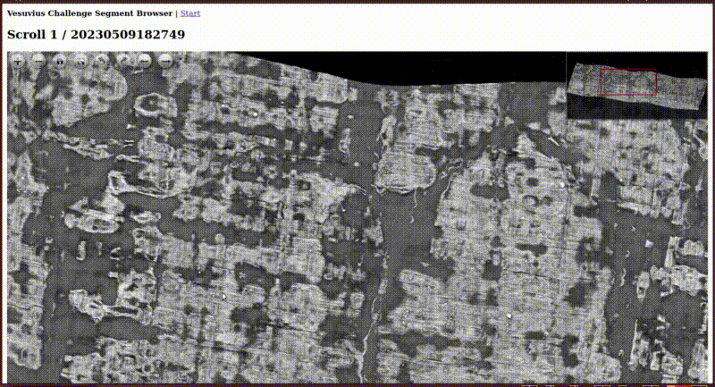

# Vesuvius Challenge Segment Browser

An unofficial web app to browse segments of the Vesuvius Challenge in a convenient way.

## Usage

A public version of the app is hosted at [https://vesuvius.virtual-void.net/](https://vesuvius.virtual-void.net/). To
access it you will need to fill out the official registration form and use the same credentials as for the Vesuvius
Challenge data server.



### Run with docker

Build the docker container:

```
docker build .
```

Run with

```
docker run -p 8089:8089 -v <data dir>:/data -e APP_HOST=0.0.0.0 -e APP_DATA_USERNAME=<official data server username> -e APP_DATA_PASSWORD=<official data server password> <image id>
```

### Run with sbt

Install [sbt](https://scala-sbt.org) or use the included script `sbt` to run the app.

Run

```
reStart --- -Dapp.data-username=<official data server username> -Dapp.data-password=<official data server password>
```

to start the server in the background.

Visit http://localhost:8089/ to access the app.

## Data License

Accessing the data on https://vesuvius.virtual-void.net/ or through this app requires you to fill out the official
form and agree to the terms of the data license. See https://scrollprize.org/data.

## License

Code released under the MPL 2.0. See [LICENSE](LICENSE) for the full license text.